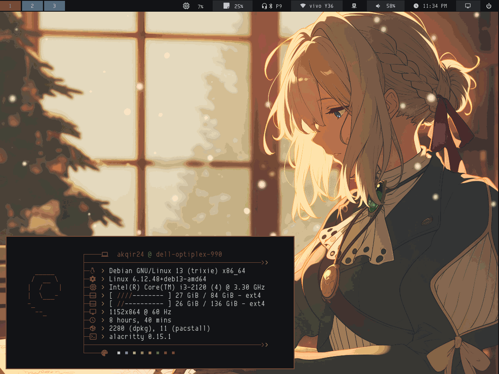

  
<h1 align="center"> aKqir's .files </h1>

Finally I am satisfied, the story of this rice is when I got tired of trying so many linux distros. I did enjoy ricing some of them like Arch, Artix, Ubuntu, & Linux Mint ( My First Distro ), but nowadays time is not in my hand and I have grown trying fix many errors I encounter with these distros. So to ease the pain from this torture, I went searching for the most stable linux distro I could find, and it is debian, where I can finally say I am home:D

<br>


| Distro | __WM__ | __Compositor__ | __Status__            | __Terminal__ | __Launcher__ | __Theme__ |
|--------|--------|----------------|-----------------------|--------------|--------------|-----------|
| Debian | i3wm   |   picom        | i3bar + i3status-rust | alacritty    |   rofi       | pywal16   | 


## Installation

```bash
bash -c "$(curl -fsSL https://raw.githubusercontent.com/aKqir24/.files/refs/heads/main/setup.sh)"
```
