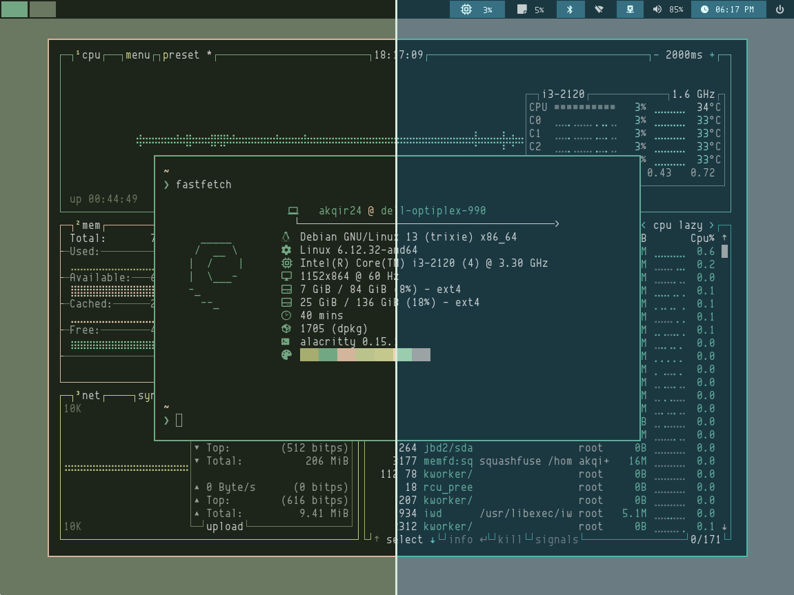

# Workspace-Rices
My repository with some of my rices or setups from a couple of months in searching in the web!! These are just backups to savemy systems incase of incompatiblities when cloning these configurations to another computer:D

---

 

|   __TYPE__           |                               __NAME__                               |
|----------------------|----------------------------------------------------------------------|
| __WM:__              | i3wm                                                                 |
| __Compositor:__      | NONE                                                                 |
| __Status:__          | i3bar + i3status-rust                                                |
| __Terminal:__        | alacritty                                                            |
| __Launcher:__        | rofi                                                                 |
| __Colorscheme:__     | pywal16                                                              |
| __Theme__:           | pywal16                                                              |
| __Font:__            | EnvyCodeR NF, Lilex, Feather                                         |
| __Fetch:__           | fastfetch                                                            |

 
<h3 align=center> Screenshot </h3>

  

 

---
