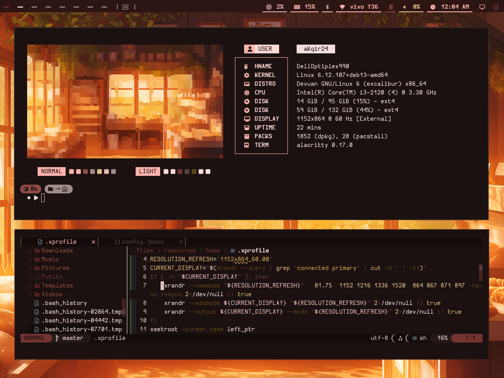
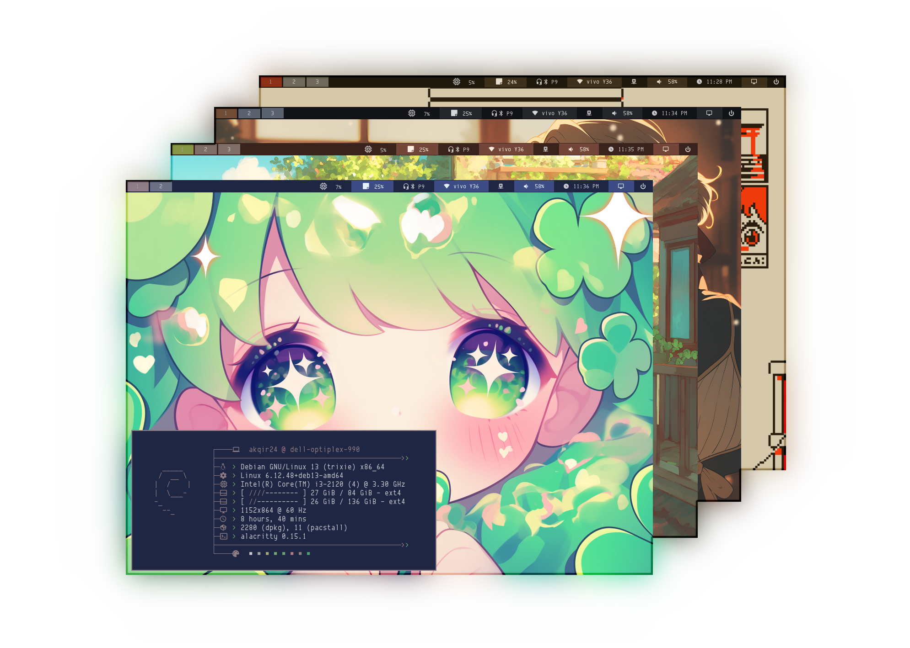

<div align="center"> 
  
# aKqir's .files


<br>

</div>
Finally I am satisfied, the story of this rice is when I got tired of trying so many linux distros. I did enjoy ricing some of them like Arch, Artix, Ubuntu, & Linux Mint ( My First Distro ), but nowadays time is not in my hand and I have grown trying fix many errors I encounter with these distros. So to ease the pain from this torture, I went searching for the most stable linux distro I could find, and it is debian, where I can finally say I am home:D
</div>

## Previews
| **CURRENT**                       | **OLD**                                      |
|-----------------------------------|----------------------------------------------|
|  |  |

## Installation

```bash
bash -c "$(curl -fsSL https://raw.githubusercontent.com/aKqir24/.files/refs/heads/main/install.sh)"
```
